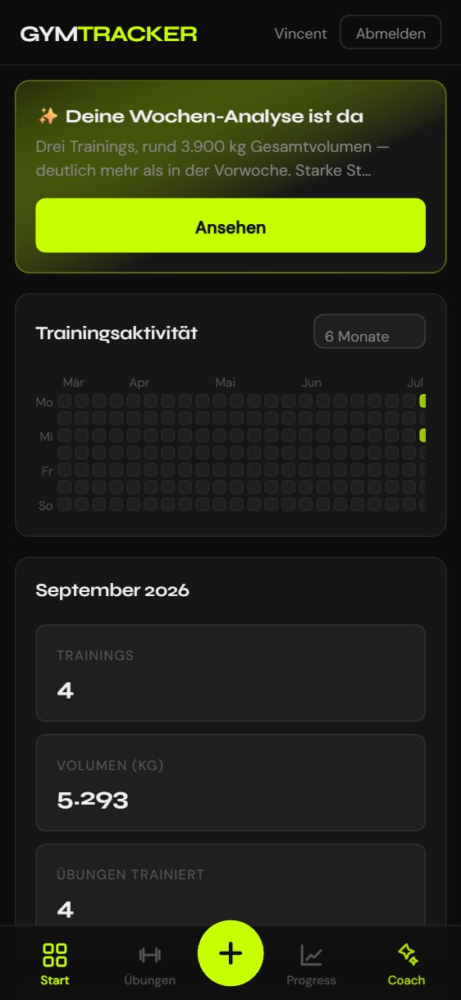
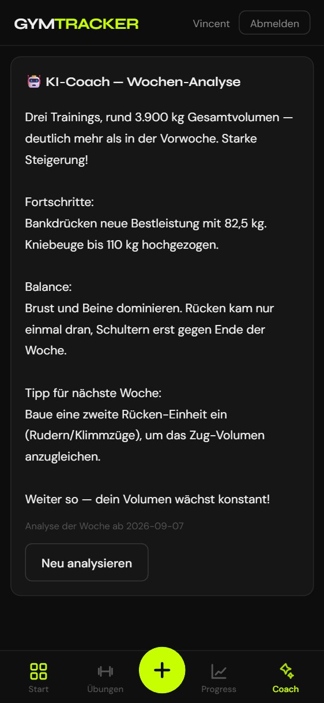
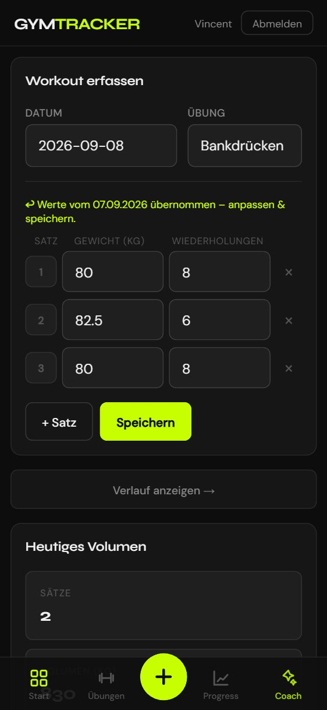

<p align="center">
  
</p>

<p align="center">
  <a href="https://github.com/VincentReddi/gym-tracker/actions/workflows/static.yml">
    
  </a>
  
  
  
  
</p>

<p align="center">
  <b>🔗 <a href="https://vincentreddi.github.io/gym-tracker/">Live-Demo</a></b>
</p>

Eine schlanke, **installierbare** Web-App zum Tracken von Krafttraining: Übungen anlegen,
Workouts mit Sätzen/Gewicht/Wiederholungen loggen, Fortschritt in Charts sehen, die
Trainingsaktivität als Heatmap — und sonntags eine **persönliche KI-Wochenanalyse**.
Läuft komplett im Browser, ohne Build-Schritt, offline-fähig, und synchronisiert optional
über einen privaten GitHub-Gist.

## 📱 Screenshots

<p align="center">
  
  &nbsp;
  
  &nbsp;
  
</p>
<p align="center"><sub>Dashboard mit KI-Karte &amp; Heatmap · KI-Wochenanalyse · Loggen mit Auto-Vorbelegung</sub></p>

## ✨ Features

- **Dashboard** – Aktivitäts-Heatmap, Monatskennzahlen (Trainings, Volumen, Übungen) und Fortschritts-Chart pro Übung
- **🤖 KI-Coach** – sonntags (ab 2 Trainings/Woche) eine kompakte, persönliche Analyse deiner Trainingswoche
- **Loggen** – Workout mit beliebig vielen Sätzen erfassen; die Werte der letzten Einheit werden **automatisch vorausgefüllt**
- **Übungen** – nach Muskelgruppe gruppiert; Löschen entfernt **kaskadierend** auch die zugehörigen Einträge (mit Bestätigung)
- **Verlauf & Fortschritt** – komplette Historie, filterbar; Charts für Max-Gewicht und Volumen inkl. Trend
- **Multi-Device-Sync** – über einen privaten GitHub-Gist, mit konfliktfreiem **Merge** (kein Datenverlust bei parallelen Geräten)
- **📲 Installierbar (PWA)** – „Zum Homescreen hinzufügen", Vollbild, **offline**; auf Mobile mit **Bottom-Navigation** und Touch-Feinschliff

## 🧰 Tech-Stack

- **Vanilla JavaScript** (ES-Module, kein Framework, kein Bundler)
- **[Chart.js](https://www.chartjs.org/)** (selbst gehostet, offline-fähig)
- **localStorage** als Cache · **GitHub Gists** als Sync-Backend
- **Web Crypto** (SHA-256) fürs Login · **Service Worker** + **Web App Manifest** für PWA/Offline
- **KI-Coach** über einen kleinen **Deno-Deploy-Proxy** (hält den API-Key server-seitig)
- Deployment über **GitHub Pages** (GitHub Actions)

## 📂 Projektstruktur

```text
gym-tracker/
├── index.html                 # Markup – keine Logik, keine Inline-Handler
├── styles.css                 # Gesamtes Styling
├── manifest.json · sw.js      # PWA (installierbar + offline)
├── icons/                     # App-Icons
├── vendor/chart.umd.min.js    # Chart.js, selbst gehostet
├── src/
│   ├── main.js                # Einstiegspunkt: Event-Verdrahtung + Navigation
│   ├── state.js               # Zustand, localStorage, Merge & Tombstones
│   ├── sync.js                # Gist-Sync: Pull → Merge → entprellter Push
│   ├── auth.js                # Login (SHA-256, kein Klartext)
│   ├── coach.js               # KI-Wochenanalyse (Frontend)
│   ├── whatsnew.js · utils.js
│   └── views/                 # dashboard · exercises · log · history · progress
├── worker/                    # KI-Proxy (Deno Deploy) + Setup-Anleitung
└── .github/workflows/static.yml   # Auto-Deploy nach GitHub Pages
```

## 🚀 Lokale Entwicklung

Weil die App ES-Module nutzt, muss sie über **HTTP** ausgeliefert werden (`file://` geht nicht).
Ein beliebiger statischer Server genügt:

```bash
python -m http.server 5510
```

Danach http://localhost:5510 öffnen.

## 🤖 KI-Coach einrichten

Die KI läuft über einen winzigen Proxy, damit der API-Key **nie in den Browser** gelangt.
Komplette Schritt-für-Schritt-Anleitung: **[`worker/README.md`](worker/README.md)** — kurz:

1. Anthropic-API-Key besorgen (+ Spend-Limit als Kostenbremse).
2. [`worker/deno-deploy.js`](worker/deno-deploy.js) bei **Deno Deploy** deployen, `ANTHROPIC_API_KEY` als Secret setzen.
3. Die Proxy-URL in [`src/coach.js`](src/coach.js) bei `AI_ENDPOINT` eintragen.

## 🔐 Sicherheit (ehrlich)

Dies ist eine **statische Seite ohne eigenen Server**. Das Login ist deshalb eine Komfort-Hürde,
kein echter Zugriffsschutz: Es liegen **keine Klartext-Passwörter** im Code (nur SHA-256-Hashes),
aber ein clientseitiges Login lässt sich technisch immer umgehen. Was die Daten tatsächlich
schützt, ist der private **GitHub-Token**; der KI-Key liegt server-seitig im Proxy. Für echte
Mehrbenutzer-Authentifizierung bräuchte es ein Backend.

## 📄 Lizenz

[MIT](LICENSE)
